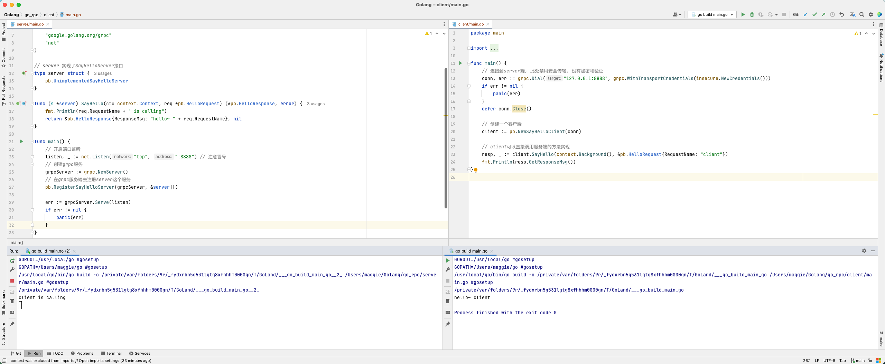

### gRPC

> **RPC**
> 
> 远程过程调用, 它允许像调用本地服务一样调用远程服务, 与RPC对应的是本地调用
> 
> RPC是一种服务器/客户端(CS)模式, 经典实现是一个通过发送请求-接受回应进行信息交互的系统
> 
> - 如何确定要执行的函数?
>   - 在本地调用中, 函数主体通过函数指针函数指定,编译器通过函数指针函数自动确定函数在内存中的位置
>   - 在RPC中, 内存地址不同, 调用不能通过函数指针完成, 调用方和被调用方都需要维护一个「func↔️ID」的映射表, 以确保调用正确的函数
> - 如何表达参数?
>   - 本地过程调用中传递的参数是通过堆栈内存结构实现的
>   - RPC不能直接使用内存传递参数, 参数或返回值需要在传输期间序列化并转换成字节流, 反之亦然
> - 如何进行网络传输?
>   - 函数的调用方和被调用方通常是通过网络连接的, 具体使用TCP或者HTTP协议都可以
> 
> - [RPC原理与Go RPC](https://github.com/mao888/golang-guide/blob/main/%E5%BE%AE%E6%9C%8D%E5%8A%A1/document/RPC%E5%8E%9F%E7%90%86%E4%B8%8EGo%20RPC.md)

> `RPC` 🆚 `Restful API`
> 
> - 基于`RESTful API`通常是基于HTTP协议, 传输数据采用**JSON等文本协议**, 
> - RPC直接使用TCP协议, 传输数据多采用**二进制协议**来说, `RPC`通常相比`RESTful API`性能会更好
> - `RESTful API`多用于前后端之间的数据传输, 而目前微服务架构下各个微服务之间多采用`RPC`调用

> Go语言的`rpc`包提供对通过网络或其他 i/o 连接导出的对象方法的访问, 
> 
> 服务器注册一个对象(server), 并把它作为服务对外可见(服务名称就是类型名称)
> 
> **注册**后, 对象的导出方法将支持远程访问。
> 
> 服务器可以注册不同类型的多个对象(服务), 但是不支持注册同一类型的多个对象


#### 0. 安装

##### (1) `protobuf`

```bash
brew install protobuf
```

##### (2) `grpc`

```bash
go get google.golang.org/grpc

go install google.golang.org/protobuf/cmd/protoc-gen-go@latest 
go install google.golang.org/grpc/cmd/protoc-gen-go-grpc@latest 

protoc  # 测试一下
```


#### 1. `.proto`文件

> `.proto`起到接口约束的作用
> - 创建`.proto`文件, 比如[Hello.proto](./server/proto/hello.proto)
> - 执行代码生成命令

```bash
protoc --go_out=. hello.proto  # 输出路径 源文件
protoc --go-grpc_out=. hello.proto
```

##### (1) `service` - 服务定义

> 如果想要消息类型用在RPC系统中, 可以在`.proto`文件中定义一个RPC服务接口
> 
> protobuf编译器会根据所选择的语言来生成服务接口代码和存根


##### (2) `message` - 消息类型

> `protobuf`中定义一个消息类型是通过关键字`message`实现的, 消息就是要需要传输的数据格式的定义。
> 
> `message`类似于Go语言中的`struct`, 每个**字段**有名称和类型
> 
> 一个`proto`文件可以定义多个消息类型


> **字段规则**
> 
> - `required`: 必填字段, 格式良好的`message`必须包含该字段一次, 在protobuf3中被删去
> - `optional`: 可选字段, 格式良好的`message`可以包含该字段零次或一次(不超过一次), protobuf3中删去了`required`, 都默认为`optional`
> - `repeated`: 可重复字段, 可以在个格式良好的`message`中重复任意多次(包括0次), 重复的值会被定义为**切片**


> **消息号**
> 
> 每个字段都必须有一个唯一的标识号, 标识号是`[1, 2^29-1]`范围内的整数


> **嵌套消息**
> 
> 可以在消息类型中定义和使用其它消息类型, 被嵌套的消息类型可以定义在当前消息类型的内部或者外部

```protobuf
// 被嵌套的消息类型(结构体)定义在内部
message UserInfo{
  message User{
    int32 id = 1;
    string name = 2;
    repeated string phone = 3;
  }
  repeated User info = 1; // User切片
}
```

```protobuf
// 嵌套外部消息类型(结构体)
message UserProfile {
  UserInfo.User info = 1;
}
```


#### 2. 服务端

> - 创建`gRPC Server`对象
> - `server`需要实现被调用的服务端接口
> - 将`server`注册到`gRPC Server`的内部注册中心, 这样可以在接收到请求时, 通过内部的服务发现发现该服务端接口并转接进行逻辑处理
> - 创建`Listen`, 指定`tcp`端口, `gRPC Server`开始监听

```GO
type server struct {
	pb.UnimplementedSayHelloServer
}

func (s *server) SayHello(ctx context.Context, req *pb.HelloRequest) (*pb.HelloResponse, error) {
	return &pb.HelloResponse{ResponseMsg: "hello~" + req.RequestName}, nil
}

func main() {
	// 开启端口监听
	listen, _ := net.Listen("tcp", "8888")
	
	// 创建grpc服务
	grpcServer := grpc.NewServer()
    
	// 在grpc服务端去注册server这个服务
	pb.RegisterSayHelloServer(grpcServer, &server{})

	err := grpcServer.Serve(listen)
	if err != nil {
		panic(err)
	}
}
```


#### 3. 客户端

```GO
func main() {
	// 连接到server端, 此处禁用安全传输, 没有加密和验证
	conn, err := grpc.Dial("127.0.0.1:8888", grpc.WithTransportCredentials(insecure.NewCredentials()))
	if err != nil {
		panic(err)
	}
	defer conn.Close()

	// 创建一个客户端
	client := pb.NewSayHelloClient(conn)

	// client可以像调用本地方法一样调用远程方法
	resp, _ := client.SayHello(context.Background(), &pb.HelloRequest{RequestName: "client"})
	fmt.Println(resp.GetResponseMsg())
}
```




#### 4. 认证及安全传输

todo, 看完https再做

> - 基于`SSL/TLS`的认证方式
> - 基于Token的认证方式
